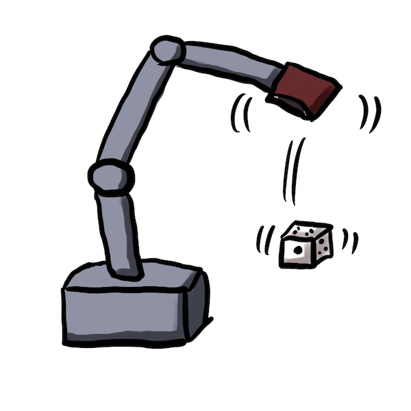

# han_cho_bot
Dice game of betting Han(odd) or cho(even) 



## Dependency

- Python3
- macOS / Linux / JetPack(Jetson Nano)
- TensorFlow==2.x
- myCobot Atom version 2.7
- pymycobot==2.3.3

## Setup

### Mac(Apple Silicon)

```sh
$ pip3 install pymycobot==2.3.3
```

Refer to following article for installing TensorFlow:

https://zenn.dev/karaage0703/articles/665e0cbdbd69f0


### Jetson Nano

```sh
$ cd && git clone https://github.com/karaage0703/jetson-nano-tools
$ cd ~/jetson-nano-tools
$ ./install-tensorflow-v45.sh
$ sudo pip3 uninstall tensorflow
$ sudo pip3 install --pre --extra-index-url https://developer.download.nvidia.com/compute/redist/jp/v45 tensorflow
$ export LD_PRELOAD=/usr/lib/aarch64-linux-gnu/libgomp.so.1
```

## Usage

### Mac(Apple Silicon)

```sh
$ python3 predict_dice_on_camera.py
```

### Jetson Nano

```sh
$ OPENBLAS_CORETYPE=ARMV8 python3 predict_dice_on_camera.py -d='jetson_nano_raspi_cam'
```


## License
This software is released under the MIT License, see LICENSE.

## Authors
karaage0703

## References

- https://zenn.dev/karaage0703/articles/0ab9e654cfb0ec
